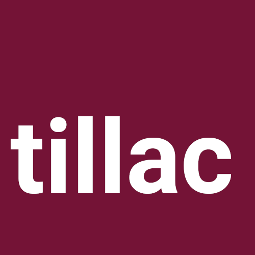

```{r setup, include=FALSE}
options(htmltools.dir.version = FALSE)

knitr::opts_chunk$set(echo = FALSE)
```

# À propos

### Thomas Vroylandt

Statisticien de formation (ENS-EHESS-ENSAE), j'ai travaillé dans des institutions publiques sur l'emploi, le marché du travail et la formation. En parallèle, j'ai lancé Tillac, une entreprise de conseil sur R et tous les sujets touchants à la donnée.

[Tillac - Site web](https://www.tillac-data.com/)

---
# L'état des lieux

`r icon::fontawesome(style = "solid", "arrow-alt-circle-right")` On souhaite souvent générer des PDF directement depuis R car :

  + assure la reproductibilité ;
  + permet de ne pas changer d'outil ;
  + autorise des approches paramétrisées ;
  + c'est un format portable ;
  + très utilisé pour les rapports ou les documents d'entreprise.
  
---
# L'état des lieux

`r icon::fontawesome(style = "solid", "bomb")`  Sauf que :
  
  + les sorties LaTeX sont peu attrayantes
  
```{r, out.height='250px'}
knitr::include_graphics("https://i.stack.imgur.com/Nug7W.png", dpi = 100)
```

  + elles demandent des compétences pointues de personnalisation
  + le multi-support (web + PDF est difficile à gérer)

---
# Une proposition de solution

https://rfortherestofus.com/ Il est possible d'imprimer des pages Web spécialement mises en forme grâce au projet [paged.js](https://www.pagedjs.org/).

`r icon::fontawesome(style = "solid", "lightbulb")` Il a été transcrit pour être utilisé en R dans [pagedown](https://github.com/rstudio/pagedown).

`r icon::fontawesome(style = "solid", "arrow-alt-circle-right")` Les avantages :

  + On peut donc utiliser les outils du design Web (HTML / CSS / JS) pour imprimer des documents PDF.
  + La qualité du design s'en trouve grandement accrue.
  + On peut alors collaborer avec des spécialistes du sujets (designers par exemple) pour nous soutenir.
  
`r icon::fontawesome(style = "solid", "bomb")` Sa qualité principale (outils web) le rend aussi difficile d'approche, malgré une excellente documentation.

---
# Une surcouche : `pagedreport`

`r icon::fontawesome(style = "solid", "question")` Projet en collaboration avec David Keyes de [R for the Rest of Us](https://rfortherestofus.com/).

`r icon::fontawesome(style = "solid", "lightbulb")` Le principe :

  + construire des templates déjà designés ;
  + qui sont personnalisables.
  
`r icon::fontawesome(style = "solid", "bullseye")` L'objectif : 

  + construire des produits viables et utlisables rapidement ;
  + itérer ensuite pour construire du sur-mesure.

---
# Les templates : windmill

```{r, out.height='450px'}
knitr::include_graphics("https://mk0rfortheresto0o08q.kinstacdn.com/wp-content/uploads/2021/01/windmill.gif", dpi = 200)
```

---
# Les templates : grid

```{r, out.height='450px'}
knitr::include_graphics("https://mk0rfortheresto0o08q.kinstacdn.com/wp-content/uploads/2021/01/grid.gif", dpi = 200)
```

---
# Les templates : hazelnuts

```{r, out.height='450px'}
knitr::include_graphics("https://mk0rfortheresto0o08q.kinstacdn.com/wp-content/uploads/2021/01/hazelnuts.gif", dpi = 200)
```

---
# Fonctionnement

`r icon::fontawesome(style = "solid", "lightbulb")` Tout se personnalise directement dans le YAML :

```{yaml, echo = TRUE, eval= FALSE}
---
title: "Annual North"
subtitle: "Christmas activity report"
author: "Santa Claus"
date: "December 2020"
output:
  pagedreport::paged_hazelnuts:
    front_img: "https://images.pexels.com/photos/717988/pexels-photo-717988.jpeg?auto=compress&cs=tinysrgb&h=750&w=1260"
    back_img: "https://images.pexels.com/photos/3303615/pexels-photo-3303615.jpeg?auto=compress&cs=tinysrgb&dpr=1&w=500"
    logo: "https://www.flaticon.com/svg/static/icons/svg/268/268225.svg"
    img_to_dark: TRUE
    logo_to_white: TRUE
knit: pagedown::chrome_print
toc-title: "Table of Contents"
main-color: "#E40A2D"
secondary-color: "#00873E"
google-font: TRUE
main-font: "Raleway"
header-font: "Mountains of Christmas"
---
```

---
# Fonctionnement

Démonstration

---
# Ressources

`r icon::fontawesome(style = "solid", "book")` Vous pouvez utiliser :

+ le repo Github : https://github.com/rfortherestofus/pagedreport
+ le site de documentation : https://pagedreport.rfortherestofus.com/
+ l'article de blog de David : https://rfortherestofus.com/2021/01/announcing-pagedreport/

---
# Pour aller plus loin : [sgdf](https://github.com/tvroylandt/sgdf_pagedown)

```{r, out.height='450px'}
knitr::include_graphics("https://raw.githubusercontent.com/tvroylandt/sgdf_pagedown/master/img/page1.PNG", dpi = 200)
```

---
# Pour aller plus loin : [omni](https://rfortherestofus.github.io/omni/)

```{r, out.height='450px'}
knitr::include_graphics("https://p218.p3.n0.cdn.getcloudapp.com/items/4gumRNLp/Image%202020-03-22%20at%202.24.38%20PM.png", dpi = 200)
```

---
# Pour aller plus loin : [propre.brochure](https://gitlab.com/rdes_dreal/propre.brochure/-/tree/master/)

```{r, out.height='400px', out.width = '300px'}
knitr::include_graphics("img/propre.png", dpi = 200)
```

---
# Pour aller plus loin : quels usages ?

+ Construire son template demande un investissement dans les ressources Web ;

+ Mais cela peut être utile par exemple pour créer des fiches sur-mesure de rapport.

`r icon::fontawesome(style = "solid", "arrow-alt-circle-right")` Par exemple avec des rapports [par ville](https://housingprofiles.pschousing.org/)

[Exemple](https://housing-profiles.s3.amazonaws.com/2020/Canton.pdf)

---
# Page de pub

En cas de besoin pour construire vos templates ou vos rapports automatisés

`r icon::fontawesome(style = "solid", "arrow-alt-circle-right")` Appelez-nous : 

<div style = "display:flex">

<div style = "flex: 50%;">
<a href = "https://rfortherestofus.com/consulting/"></a>
</div>

<div style = "flex: 50%;">
<a href = "https://www.tillac-data.com/"></a>
</div>
</div>

---
class: last, center, middle

## Merci de votre attention